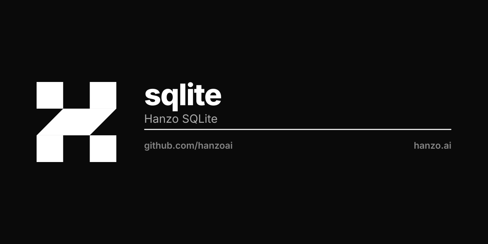

<p align="center"></p>

# Hanzo SQLite

Dual-backend SQLite driver for the Hanzo ecosystem. Registers the
`database/sql` driver name **`sqlite`** under both build configurations and
exposes the same API either way. **Both backends encrypt at rest, in the same
SQLCipher-4 format** — a database written by one opens under the other.

| Build | Backend | Encryption | Use |
|-------|---------|------------|-----|
| `CGO_ENABLED=0` (default) | vendored pure-Go engine + **hanzoai/sqlcipher** codec VFS | AES-256 page-level, at rest | **default** — CI, tests, pure-Go deploys |
| `CGO_ENABLED=1` + `-tags libsqlite3` + libsqlcipher | **hanzoai/csqlite** → SQLCipher | AES-256 page-level, at rest | the C engine, for speed |

One import, one driver name, two backends, one format:

```go
import _ "github.com/hanzoai/sqlite" // registers "sqlite" under both tags

db, _ := sql.Open("sqlite", dsn)     // pure-Go codec VFS (!cgo) or csqlite+SQLCipher (cgo)
```

The pure-Go backend **always encrypts** — no cgo, no external C library, nothing
to link, and **`go list -m all` shows zero `modernc.org/*`** (the engine is
vendored in-tree). A keyed database is single-writer, single-process (WAL on an
in-process wal-index).

## Building the CGO backend (optional, for the C engine's speed)

The default `CGO_ENABLED=0` build already encrypts and needs no flags. The CGO
backend uses hanzoai/csqlite linked against libsqlcipher, with the key supplied as
SQLCipher's native URI `key` parameter (applied inside `sqlite3_open_v2`, so create
and reopen both work):

```sh
CGO_ENABLED=1 \
CGO_CFLAGS="-DSQLITE_HAS_CODEC -DSQLITE_USE_URI=1 -I<sqlcipher>/include/sqlcipher" \
CGO_LDFLAGS="-L<sqlcipher>/lib -lsqlcipher" \
go build -tags "libsqlite3 sqlite_fts5" ./...
```

Alpine: `apk add gcc musl-dev sqlcipher-dev pkgconfig`. A cgo build that forgets
to link libsqlcipher silently writes plaintext; `CodecLinked()` proves the codec
at runtime and `TestEncryptionProof` fails such a build.

> On the CGO backend the key rides the DSN (`file:PATH?...&key=x'HEX'`). **Never
> log the DSN.** On the pure-Go backend the key never touches the DSN — it binds
> to the codec VFS.

## Encryption

- Algorithm: AES-256 (SQLCipher 4 defaults: 4096-byte pages, PBKDF2-HMAC-SHA512,
  256000 iters, per-page HMAC-SHA512).
- Key: raw 256-bit (no passphrase KDF) via `WithRawKey` / the `key=x'HEX'` DSN
  param, or derived per principal:

```go
// CEK = HKDF-SHA256(masterKey, "{org|user}:{id}")
db, _ := sqlite.Open("data.db", sqlite.WithPrincipalKey(masterKey, sqlite.PrincipalOrg, "acme"))

// Or get a *sql.DB to hand to xorm.NewEngineWithDB:
cek, _ := sqlite.DeriveKey(masterKey, sqlite.PrincipalOrg, "acme")
sqldb, _ := sqlite.OpenDB(dbPath, cek)
eng, _ := xorm.NewEngineWithDB("sqlite", "", core.FromDB(sqldb))
```

Different orgs/users get different CEKs (domain-separated `info`); destroying the
master key renders every derived CEK irrecoverable.

## Per-principal CEK

`DeriveKey(masterKey, principalType, principalID)` → 32-byte CEK via HKDF-SHA256.
Master key is 32 bytes, sourced from KMS. Used for per-org and per-user database
isolation in IAM, KMS, and other Hanzo services.

## Threshold write attestation

`ThresholdManager` coordinates t-of-n Ed25519 attestations for writes (MPC shard
storage, multi-sig). Pure Go; available under both backends.

## License

Apache-2.0
